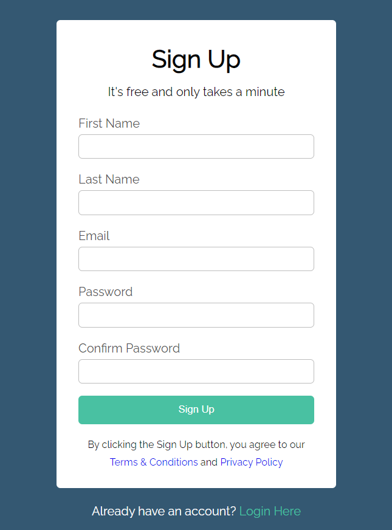
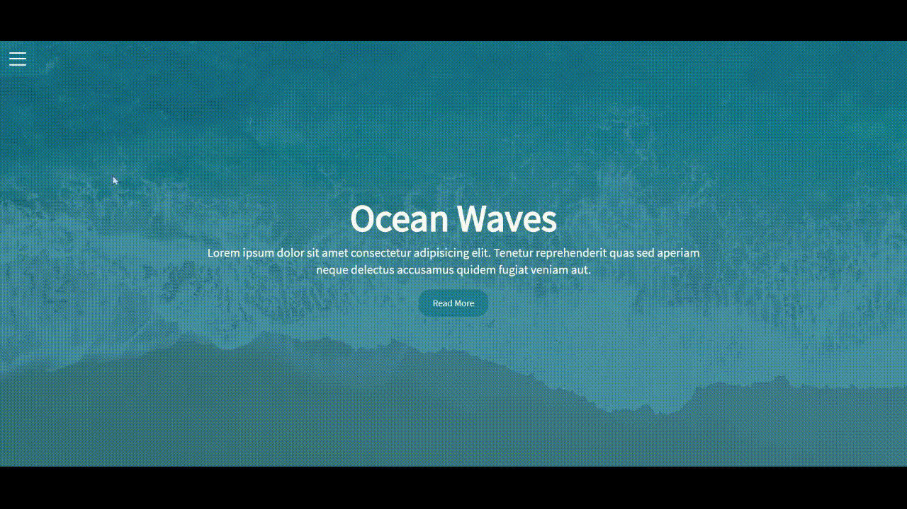

# About
## Websites
### 1. [Hotel](https://github.com/acyein/modern-html-css/tree/master/04-HotelWebsite)  
🔗 [bloominghotel.netlify.app](https://bloominghotel.netlify.app/)

### 2. [EdgeLedger](https://github.com/acyein/modern-html-css/tree/master/07-EdgeLedgerWebsite)  

### 3. [Portfolio](https://github.com/acyein/portfolio)  
🔗 [acyein.netlify.app](https://acyein.netlify.app)  

## Mini Projects
### 1. [Sign Up Form](https://github.com/acyein/modern-html-css/tree/master/03-CSSBasics)  

### 2. [Presentation Slides](https://github.com/acyein/modern-html-css/tree/master/10-MiniProjects/01-PresentationSlides)  (Game of Thrones inspired)  

### 3. [Hamburger Menu Overlay](https://github.com/acyein/modern-html-css/tree/master/10-MiniProjects/02-HamburgerMenuOverlay)  

### 4. [Songs Picks Timeline](https://github.com/acyein/modern-html-css/tree/master/10-MiniProjects/03-SongPicksTimeline)  
A timeline that displays a list of my favourite songs in each month of 2020

### 5. [Dropdown Menu](https://github.com/acyein/modern-html-css/tree/master/10-MiniProjects/04-DropdownMenu)

# Course Details
**Title**: [Modern HTML & CSS From The Beginning (Including Sass)](https://www.udemy.com/course/modern-html-css-from-the-beginning/)  
**Instructor**: Brad Traversy  
**Medium**: [Udemy](https://www.udemy.com/)  
**Started**: September 09, 2020  
**Completed**: September 23, 2020